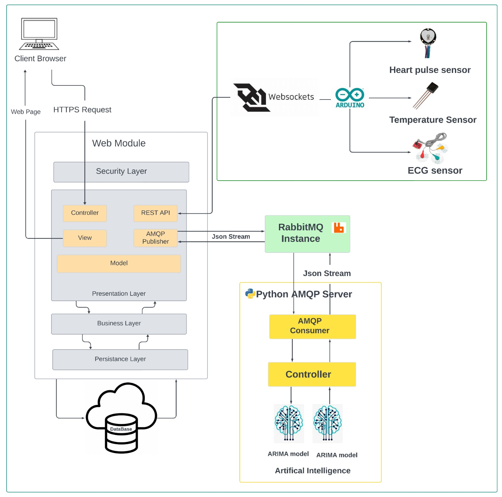
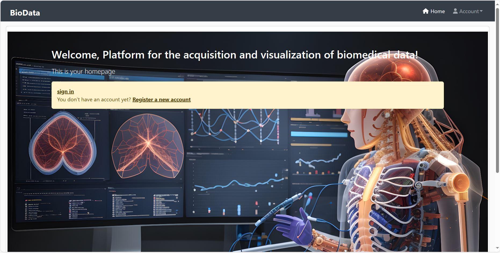

# appbiomedicale

This application was generated using JHipster 7.9.3, you can find documentation and help at [https://www.jhipster.tech/documentation-archive/v7.9.3](https://www.jhipster.tech/documentation-archive/v7.9.3).

## Introduction
The BioData software system represents a groundbreaking venture tailored to address the burgeoning demands of the healthcare sector through the integration of cutting-edge biomedical technologies. At its core, the project aims to empower healthcare professionals by enabling real-time collection and visualization of biomedical data, thereby granting immediate access to crucial patient health information. Emphasizing secure authentication and user management, the platform facilitates seamless registration and login for healthcare professionals, ensuring efficient management of their personal details. Key features include the integration of diverse sensors, such as those employed in Arduino technology, with a user-friendly graphical interface designed for effective data interpretation. Beyond data collection, the system focuses on the manipulation of biomedical data, streamlining information for comprehensive understanding by healthcare professionals. Advanced analysis tools are integrated, empowering healthcare professionals to make informed medical decisions and harness predictions based on data collected by medical devices. Patient management functionalities allow for the assignment of medical devices to specific patients, facilitating real-time medical monitoring. Administratively, the system provides administrators with capabilities for user management and oversight of medical devices and associated sensors. The user interface is thoughtfully designed to ensure an optimal experience across various devices, embracing a user-centric approach that emphasizes accessibility for a diverse range of users, regardless of their computer skills. In essence, the BioData software system stands as a multifaceted solution, uniting technological innovation with healthcare expertise to elevate data-driven decision-making and patient care.
## Project architecture
The software architecture of the BioData platform is designed with distinct components to ensure system efficiency and functionality. On the server side, Spring Boot simplifies the development of standalone Java applications and facilitates the creation of a RESTful API for structured communication with the ReactJS client. Relational databases are seamlessly managed using Spring Boot and Hibernate. Data collected undergoes processing by machine learning algorithms, generating valuable medical predictions. On the client side, ReactJS provides interactive user interfaces with reusable components and efficient state management for dynamic updates. Security is enhanced by Spring Security, integrated on the server side, offering advanced authentication and authorization management. The data collection process utilizes the Arduino board equipped with sensors, transmitting data to the server via protocols like HTTP or MQTT. For asynchronous messaging, RabbitMQ is employed, providing a robust infrastructure for communication between components. Lastly, the ARIMA statistical model is employed for the analysis and forecasting of time series, contributing to informed decision-making based on historical medical data.

## Project functionalities
The BioData software system is crafted to meet the increasing demands in
the healthcare sector, making the most of advancements in biomedical tech-
nologies. Its main goal is to empower healthcare professionals, allowing them
to gather and view real-time biomedical data, providing immediate access to
their patients’ health information. Additionally, the system seeks to simplify
the handling of this data, making it easier for healthcare professionals to
understand and make informed medical decisions.
In this initiative, several essential features have been highlighted. Firstly,
there is a focus on secure authentication and user management, enabling
healthcare professionals to register, log in, and manage their personal de-
tails. Regarding the collection and visualization of biomedical data, the
platform ensures the real-time collection of data from various sensors, in-
cluding Arduino sensors, and offers a graphical interface for efficient visual
interpretation.
The manipulation of biomedical data is a critical aspect of the system, aiming
to streamline these data for easier understanding by healthcare profession-
als. Simultaneously, advanced analysis tools will be integrated, empowering
healthcare professionals to make informed medical decisions and leverage
predictions of the patient’s condition based on data collected by medical
devices.
Patient management is also central, allowing healthcare professionals to as-
sign medical devices to specific patients, facilitating real-time medical moni-
toring. From an administrative standpoint, administrators will handle tasks
such as adding, modifying, and deleting users, as well as managing medical
devices and associated sensors.
Finally, the user interface will be designed to be user-friendly, ensuring an
optimal experience on various devices, including mobile devices. This user-
centric approach ensures that the platform is accessible to a wide range of
users, regardless of their computer skills.
## Project-Interfaces


## Project

Node is required for generation and recommended for development. `package.json` is always generated for a better development experience with prettier, commit hooks, scripts and so on.

In the project root, JHipster generates configuration files for tools like git, prettier, eslint, husky, and others that are well known and you can find references in the web.

`/src/*` structure follows default Java structure.

- `.yo-rc.json` - Yeoman configuration file
  JHipster configuration is stored in this file at `generator-jhipster` key. You may find `generator-jhipster-*` for specific blueprints configuration.
- `.yo-resolve` (optional) - Yeoman conflict resolver
  Allows to use a specific action when conflicts are found skipping prompts for files that matches a pattern. Each line should match `[pattern] [action]` with pattern been a [Minimatch](https://github.com/isaacs/minimatch#minimatch) pattern and action been one of skip (default if ommited) or force. Lines starting with `#` are considered comments and are ignored.
- `.jhipster/*.json` - JHipster entity configuration files

- `npmw` - wrapper to use locally installed npm.
  JHipster installs Node and npm locally using the build tool by default. This wrapper makes sure npm is installed locally and uses it avoiding some differences different versions can cause. By using `./npmw` instead of the traditional `npm` you can configure a Node-less environment to develop or test your application.
- `/src/main/docker` - Docker configurations for the application and services that the application depends on

## Development

Before you can build this project, you must install and configure the following dependencies on your machine:

1. [Node.js][]: We use Node to run a development web server and build the project.
   Depending on your system, you can install Node either from source or as a pre-packaged bundle.

After installing Node, you should be able to run the following command to install development tools.
You will only need to run this command when dependencies change in [package.json](package.json).

```
npm install
```

We use npm scripts and [Webpack][] as our build system.

Run the following commands in two separate terminals to create a blissful development experience where your browser
auto-refreshes when files change on your hard drive.

```
./mvnw
npm start
```

Npm is also used to manage CSS and JavaScript dependencies used in this application. You can upgrade dependencies by
specifying a newer version in [package.json](package.json). You can also run `npm update` and `npm install` to manage dependencies.
Add the `help` flag on any command to see how you can use it. For example, `npm help update`.

The `npm run` command will list all of the scripts available to run for this project.

### PWA Support

JHipster ships with PWA (Progressive Web App) support, and it's turned off by default. One of the main components of a PWA is a service worker.

The service worker initialization code is commented out by default. To enable it, uncomment the following code in `src/main/webapp/index.html`:

```html
<script>
  if ('serviceWorker' in navigator) {
    navigator.serviceWorker.register('./service-worker.js').then(function () {
      console.log('Service Worker Registered');
    });
  }
</script>
```

Note: [Workbox](https://developers.google.com/web/tools/workbox/) powers JHipster's service worker. It dynamically generates the `service-worker.js` file.

### Managing dependencies

For example, to add [Leaflet][] library as a runtime dependency of your application, you would run following command:

```
npm install --save --save-exact leaflet
```

To benefit from TypeScript type definitions from [DefinitelyTyped][] repository in development, you would run following command:

```
npm install --save-dev --save-exact @types/leaflet
```

Then you would import the JS and CSS files specified in library's installation instructions so that [Webpack][] knows about them:
Note: There are still a few other things remaining to do for Leaflet that we won't detail here.

For further instructions on how to develop with JHipster, have a look at [Using JHipster in development][].

### JHipster Control Center

JHipster Control Center can help you manage and control your application(s). You can start a local control center server (accessible on http://localhost:7419) with:

```
docker-compose -f src/main/docker/jhipster-control-center.yml up
```

## Building for production

### Packaging as jar

To build the final jar and optimize the appbiomedicale application for production, run:

```
./mvnw -Pprod clean verify
```

This will concatenate and minify the client CSS and JavaScript files. It will also modify `index.html` so it references these new files.
To ensure everything worked, run:

```
java -jar target/*.jar
```

Then navigate to [http://localhost:8080](http://localhost:8080) in your browser.

Refer to [Using JHipster in production][] for more details.

### Packaging as war

To package your application as a war in order to deploy it to an application server, run:

```
./mvnw -Pprod,war clean verify
```

## Testing

To launch your application's tests, run:

```
./mvnw verify
```

### Client tests

Unit tests are run by [Jest][]. They're located in [src/test/javascript/](src/test/javascript/) and can be run with:

```
npm test
```

For more information, refer to the [Running tests page][].

### Code quality

Sonar is used to analyse code quality. You can start a local Sonar server (accessible on http://localhost:9001) with:

```
docker-compose -f src/main/docker/sonar.yml up -d
```

Note: we have turned off authentication in [src/main/docker/sonar.yml](src/main/docker/sonar.yml) for out of the box experience while trying out SonarQube, for real use cases turn it back on.

You can run a Sonar analysis with using the [sonar-scanner](https://docs.sonarqube.org/display/SCAN/Analyzing+with+SonarQube+Scanner) or by using the maven plugin.

Then, run a Sonar analysis:

```
./mvnw -Pprod clean verify sonar:sonar
```

If you need to re-run the Sonar phase, please be sure to specify at least the `initialize` phase since Sonar properties are loaded from the sonar-project.properties file.

```
./mvnw initialize sonar:sonar
```

For more information, refer to the [Code quality page][].

## Using Docker to simplify development (optional)

You can use Docker to improve your JHipster development experience. A number of docker-compose configuration are available in the [src/main/docker](src/main/docker) folder to launch required third party services.

For example, to start a mysql database in a docker container, run:

```
docker-compose -f src/main/docker/mysql.yml up -d
```

To stop it and remove the container, run:

```
docker-compose -f src/main/docker/mysql.yml down
```

You can also fully dockerize your application and all the services that it depends on.
To achieve this, first build a docker image of your app by running:

```
npm run java:docker
```

Or build a arm64 docker image when using an arm64 processor os like MacOS with M1 processor family running:

```
npm run java:docker:arm64
```

Then run:

```
docker-compose -f src/main/docker/app.yml up -d
```

When running Docker Desktop on MacOS Big Sur or later, consider enabling experimental `Use the new Virtualization framework` for better processing performance ([disk access performance is worse](https://github.com/docker/roadmap/issues/7)).

For more information refer to [Using Docker and Docker-Compose][], this page also contains information on the docker-compose sub-generator (`jhipster docker-compose`), which is able to generate docker configurations for one or several JHipster applications.

## Continuous Integration (optional)

To configure CI for your project, run the ci-cd sub-generator (`jhipster ci-cd`), this will let you generate configuration files for a number of Continuous Integration systems. Consult the [Setting up Continuous Integration][] page for more information.

[jhipster homepage and latest documentation]: https://www.jhipster.tech
[jhipster 7.9.3 archive]: https://www.jhipster.tech/documentation-archive/v7.9.3
[using jhipster in development]: https://www.jhipster.tech/documentation-archive/v7.9.3/development/
[using docker and docker-compose]: https://www.jhipster.tech/documentation-archive/v7.9.3/docker-compose
[using jhipster in production]: https://www.jhipster.tech/documentation-archive/v7.9.3/production/
[running tests page]: https://www.jhipster.tech/documentation-archive/v7.9.3/running-tests/
[code quality page]: https://www.jhipster.tech/documentation-archive/v7.9.3/code-quality/
[setting up continuous integration]: https://www.jhipster.tech/documentation-archive/v7.9.3/setting-up-ci/
[node.js]: https://nodejs.org/
[npm]: https://www.npmjs.com/
[webpack]: https://webpack.github.io/
[browsersync]: https://www.browsersync.io/
[jest]: https://facebook.github.io/jest/
[leaflet]: https://leafletjs.com/
[definitelytyped]: https://definitelytyped.org/
